# ADERA

*Unofficial companion — not an official governance document, not part of the
formal spec. It describes the general pattern in jurisdiction-neutral terms;
the reference deployment covered by the other two documents targets a
specific country's regulator and payment rails.
Diagrams are [Mermaid](https://mermaid.js.org/) code blocks, which render
automatically on GitHub and in most modern Markdown viewers (VS Code needs
the "Markdown Preview Mermaid Support" extension).*

Companion to:
- `01-ADERA-Whitepaper.md` — the formal thesis and governance spec
- `02-System-Architecture-Security-Design.md` — the threat model and defense-in-depth spec

This document follows the same structure as those two.

---

## 0. The problem

Any market with growing EV adoption ends up with multiple companies
installing and running EV chargers. Call
each one a **CPO — Charge Point Operator** (the company that owns/operates the
physical charging stations). Each CPO usually has its own app.

Separately, some companies just sell charging *access* to drivers without
owning any chargers themselves — they resell access across multiple CPOs'
networks, bill the driver once, and settle behind the scenes. Call this an
**eMSP — e-Mobility Service Provider** ("e-mobility service provider" — think
of it like a virtual network operator, but for EV charging instead of mobile
phones).

Today, a driver who is a customer of eMSP "X" can only charge at stations
belonging to CPOs that eMSP X has *individually, manually* integrated with.
If eMSP X hasn't done a deal with CPO "B", the driver is locked out of CPO
B's chargers even if one is sitting right in front of them. This is called
**roaming** in this industry (borrowed directly from the mobile-phone
industry meaning: "let a customer of network A use network B's
infrastructure"), and the *lack* of it is the problem ADERA exists to solve.

The industry already has a published, standard way for a CPO's system and an
eMSP's system to talk to each other automatically — it's called **OCPI (Open
Charge Point Interface)**. OCPI defines the *message format*: how to say "here
is a list of my charging stations," "this driver's token is valid, let them
charge," "here is the bill for the session that just finished" (that bill is
called a **CDR — Charge Detail Record**). OCPI does **not** define how two
companies are supposed to *find* each other and decide to trust each other's
messages in the first place. That missing piece — discovery and trust — is
what the rest of this document is about.

> **Note on a similar-looking acronym:** OCPI is not the same as **OCPP**
> (Open Charge Point Protocol), which is the *separate* protocol used between
> a physical charger and its own CPO's back-end (i.e., "the charger says a car
> plugged in"). ADERA and this whitepaper are entirely about OCPI —
> operator-to-operator roaming — not about the charger hardware itself.

---

## 1. Two ways to solve "how do operators find and trust each other"

### 1.1 Option A (the usual answer elsewhere): a central clearing house / "Roaming Hub"

Globally, the common solution is: one company builds a "hub." Every CPO and
every eMSP signs a contract with *that one company*, integrates with *its*
API, and all roaming traffic between operators is relayed through it.

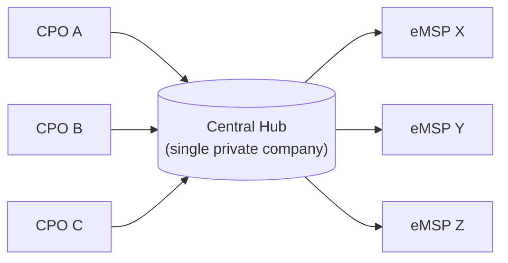

The whitepaper's objection to this, in plain terms: that one company now sits
in the middle of *every* transaction in the national EV market. It can see
who charges where, it can raise its fees once everyone depends on it, it can
be acquired by a foreign or competing entity, and if its servers go down, the
entire country's EV roaming goes down with it. For a small national market,
that's a lot of concentrated risk sitting inside a single private balance
sheet.

### 1.2 Option B (ADERA's answer): a shared, jointly-run directory instead of a company

Instead of a company in the middle, ADERA proposes a **ledger** — meaning,
plainly, a database of records that is (a) shared by all the operators
jointly instead of owned by one of them, (b) append-only / tamper-evident (you
can add new facts, but you can't secretly rewrite old ones), and (c) each
operator runs their own copy and they all agree on its contents through a
technical process called **consensus** (explained in §3).

Crucially, the ledger is used for exactly one narrow job: answering "for
Party ID `XX/XXX`, what is the current, verified address and public key to
contact them at?" It is **not** used to carry the actual OCPI traffic
(session data, tariffs, CDRs) or any money. Once two operators have looked
each other up, they talk to each other **directly** — a normal encrypted
connection between their two servers, nobody in the middle.

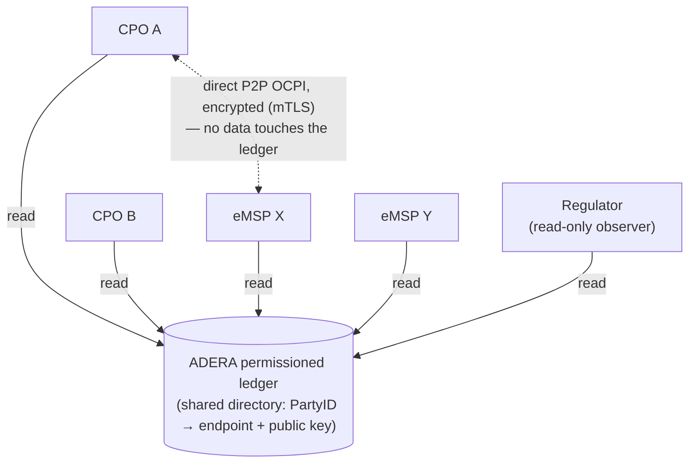

**"Permissioned"** means: unlike Bitcoin or Ethereum's public networks, where
literally anyone in the world can join and read/write, this ledger's
membership is a closed, vetted list — only licensed operators (and
the regulator itself) can even connect to it. **"P2P" (peer-to-peer)** just means two
parties talking directly to each other with no intermediary relaying the
conversation.

### 1.3 What actually goes on the ledger, and what deliberately never does

| Goes on the ledger (public to members + the regulator) | Never touches the ledger (stays private, direct between the two operators) |
| --- | --- |
| Party ID (a country code + a 3-letter operator code, e.g. `XX/CPO`) | The actual OCPI messages — tokens, session data, module endpoints |
| The legal entity's *governance key* bound to that Party ID (explained in §3.5) | Charge sessions, station locations, tariffs (prices) |
| An **encrypted** blob containing the operator's real network address | CDRs — the actual bills for completed charging sessions |
| The operator's *messaging* public key (explained in §4) | Any personal data about drivers |
| Whether the party is currently active or has been revoked | Any money-movement instruction |
| A log of every admission / revocation / key-rotation event | The real, un-encrypted network address (see next paragraph) |

Even the network address (basically: "connect to me at this URL") is not
written in plain text. It's stored **encrypted** — more on what that means
and why in §1.4. So even though every member can technically read the whole
ledger, nobody outside the consortium can map out "here is the entire
national EV charging network's topology" just by looking at it.

### 1.4 What "zero-trust" means here

**Zero-trust** does *not* mean "we don't trust anyone, so nothing works." It
means: nobody is trusted *just because* they're listed somewhere, or *just
because* a message claims to be from them. Instead, every time two parties
connect, the receiving side independently checks a cryptographic proof — "does
this connection actually control the private key that the ledger says belongs
to this Party ID?" — at that exact moment. The ledger's job is to be a
trustworthy *source of facts to check against*, not a trustworthy *middleman
that vouches for people*.

This relies on a very standard idea from cryptography called a
**public/private key pair**: you generate two mathematically linked numbers.
One (the *public* key) you can hand out to anyone — it's used to verify
things. The other (the *private* key) you never share with anyone — it's used
to *prove* things, by producing a **digital signature** that only that private
key could have produced, which anyone holding the matching public key can
check. If a message is signed with a given private key, and the ledger says
that private key's matching public key belongs to Party ID `XX/CPO`, then the
message really did come from whoever controls `XX/CPO` — *assuming* their
private key hasn't leaked. That check is what "zero trust" is actually doing
under the hood; see the full worked example in §4.4.

### 1.5 Why encrypt the endpoint at all?

An "**endpoint**" here just means "the URL/address to connect to this
operator's server." Publishing that in clear text on a ledger that's readable
by every member (and, depending on setup, possibly the wider world) would let
anyone map the entire country's charging-network topology — which companies
exist, roughly how big they are, where their infrastructure lives. That's
commercially and security-sensitive information with no operational reason to
be public. So it's stored as `endpointCipher`: ciphertext produced by
**AES-256-GCM**, a standard, fast **symmetric encryption** algorithm (meaning:
the same secret key both locks and unlocks it, unlike the public/private pair
described above which uses two *different* keys). That shared secret key is
held only by admitted consortium members, so only they can decrypt an
endpoint back into a usable address.

### 1.6 Why this is the pitch for a national regulator

- **No single company in the middle.** Nobody can raise rents, get acquired,
  or unilaterally cut an operator off.
- **No single point of failure.** As long as enough of the jointly-run ledger
  nodes are online (a **quorum** — more on this in §3.2), the whole directory
  keeps working even if some operators' nodes are down.
- **Less data to leak.** Because roaming data never passes through a central
  party, there's no single database of "every EV charging session in the
  country" for a hacker (or a curious competitor) to go after.
- **The regulator can audit it directly**, without needing anyone's
  permission or cooperation (§3.4).
- **No cryptocurrency, no new payment system.** ADERA never moves or
  represents money on-chain — it only stores identity/discovery records.
  Money still moves through the country's existing banking rails (§2).

### 1.7 One company, two registrations — every combination the system must support

The diagram in §1.2 draws `CPO-A`, `CPO-B`, `eMSP-X`, `eMSP-Y` as if they're
four different companies, for clarity. The system has to work identically no
matter which real-world shape a participant actually takes — vertically
integrated (both roles under one brand), CPO-only, eMSP-only, or anything in
between — because it can't assume any one shape is dominant.

If anything, the more likely default leans the *other* way from "every
operator builds its own app": CPOs are, generally, hardware and physical
infrastructure businesses, not software companies. Building and maintaining
a consumer-facing app is a real, ongoing software-product commitment that
plenty of CPOs are poorly positioned to take on well — so a CPO with a
commercial relationship to one or more third-party eMSPs (rather than its
own app) is arguably the more likely norm, not the exception. ADERA doesn't
get to assume either way; it has to be indifferent to which shape a given
participant chooses.

The registry, however, doesn't have a concept of "a company." It only has
**Party IDs**, and looking at the actual contract
(`contracts/AderaRegistry.sol`), two rules force a strict split:

- Every `Party` record carries exactly **one** `role` — `CPO`, `EMSP`, or
  `HUB` — never more than one.
- `entityToParty` binds exactly **one** entity key to exactly **one** Party
  ID (`require(entityToParty[entity] == bytes32(0), ...)`) — a key can't be
  bound to two Party IDs at once.

So a vertically-integrated operator has to register on the ledger **twice** —
once as `XX/ALP` with role `CPO`, and again as a *separate* Party ID (say
`XX/ALQ`) with role `EMSP`, each under its **own** entity key. This isn't a
theoretical reading of the contract — it's literally how the reference
deployment is wired: `docker-compose.yml` runs two entirely separate gateway
services for a single demo participant, one with `ADERA_ROLE=cpo` and one
with `ADERA_ROLE=emsp`.

Nothing forces the pairing, though. Registration per role is fully
independent, which is what makes two other very normal business shapes
possible:

- A **CPO-only** operator that never builds a consumer app at all — it just
  registers the `CPO` role and lets other companies' eMSPs bring it drivers.
- An **eMSP-only aggregator** that owns no chargers whatsoever — it just
  registers the `EMSP` role and roams its own driver base onto everyone
  else's stations.

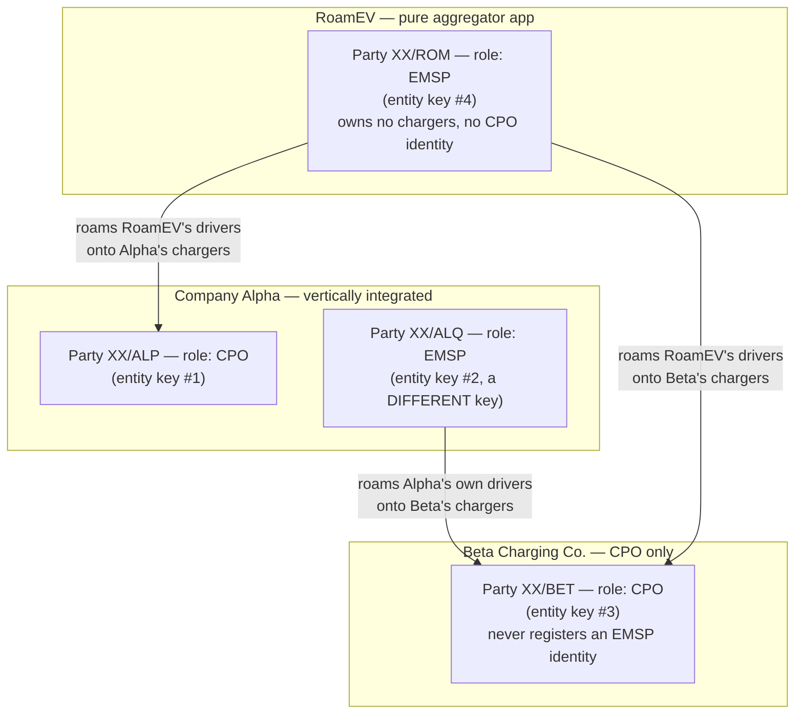

Notice every arrow points from an `EMSP`-role party to a `CPO`-role party —
never eMSP-to-eMSP, never CPO-to-CPO. That's the general rule: **the
roaming conversation is always eMSP-role → CPO-role**, because the eMSP side
is the one vouching for a driver's identity, and the CPO side is the one
that actually hosts the physical hardware. Two vertically-integrated
companies with a full mutual-roaming deal end up running this conversation
in *both* directions (A's eMSP → B's CPO, and separately B's eMSP → A's
CPO) — it just looks like "the two companies talk to each other" from the
outside because both role-pairs live under the same brand.

### 1.8 Fronted CPOs: keep identity distinct, outsource the infrastructure

A natural question once you see how many CPOs will realistically lean on an
eMSP relationship (§1.7): if an eMSP is already fronting a CPO commercially,
does that CPO really need its *own* registration on the ledger — or could the
fronting eMSP just represent it under the eMSP's own Party ID?

**It has to stay distinct, for reasons that trace straight back to §1.1's
core thesis.** If eMSP-X signs and settles on behalf of 200 physical CPOs
under its own single identity:

- **Non-repudiation collapses to a single point of trust.** A CDR's evidentiary
  value (§4.4, §6.2 — "an unambiguous, non-repudiable piece of evidence
  against the CPO") only works because it's cryptographically tied to
  *whichever specific entity's key* produced it. Blend 200 CPOs behind one
  identity and every CDR is attributed to eMSP-X, not to whichever physical
  site's meter actually generated it — the accountability trail this whole
  design exists to create is gone.
- **It quietly recreates the hub-and-spoke risk §1.1 argues against.**
  eMSP-X becomes a mini centralized clearing house for everyone behind it —
  concentrated leverage, and a single point of failure — one layer down from
  the exact pattern ADERA was built to eliminate at the national level.
- **Revocation loses its granularity.** §3.5 and §4.3's whole point is that a
  single bad actor can be individually cut off. Blended behind one Party ID,
  a fraudulent site can only be policed by revoking *all* of eMSP-X's fronted
  CPOs at once (collateral damage to the honest ones) or by handling it
  off-chain, invisibly to the regulator — breaking §3.4's "the regulator sees
  every admission and revocation directly."

Worth being precise about what's *already* fine, though: a Party ID is
already scoped per **licensed business**, not per physical charger — one CPO's
single registration already covers arbitrarily many `Locations`. So the real
question isn't "does every charging station need its own registration" (it
doesn't, and never did) — it's "does every *licensed operator* need its own
identity," and collapsing that is what causes the problems above.

**The actual fix: separate identity from infrastructure**, the same way a
payment platform like Stripe Connect still gives every sub-merchant its own
distinct account ID even though Stripe runs all the shared infrastructure
behind them.

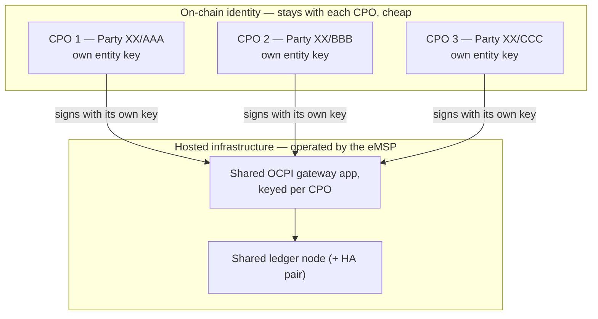

- **Identity stays distinct and cheap.** Each CPO keeps its own Party ID and
  entity key — a registry entry, not infrastructure. This preserves
  individual accountability and revocability at essentially no cost.
- **Hosting gets outsourced.** The eMSP runs the actual ledger node and OCPI
  gateway application, keyed to sign correctly on behalf of whichever CPO an
  interaction is for. One shared node (or HA pair) can serve many fronted
  CPOs, because on-chain traffic per CPO is negligible (§1.3 — only
  identity/governance events ever touch the chain).

  Concretely, this means one running process serves a **table of identities**
  rather than being hardwired to a single one — and the reference gateway
  (`gateway.js`) already works this way. It reads a tenant table from its
  environment (`TENANT_COUNT`, then `TENANT_<i>_PARTY_ID` /
  `TENANT_<i>_MESSAGING_KEY` per identity) and routes every request by the
  Party ID named in the URL path
  (`/party/<country>/<partyId>/ocpi/2.2.1/credentials`), looking up that
  party's key and handing it to the same signing/verifying logic throughout.
  Everything downstream of that lookup — `signBody`, `recoverSigner`,
  `resolveEndpoint`, `openSettlementChannel` — never assumed a single identity
  to begin with. The PoC runs one tenant per process only because that is all
  the demo needs; adding a second fronted CPO behind the same gateway is
  `TENANT_COUNT=2` plus a `TENANT_2_*` block, a config change rather than a
  code change. The per-party URL this produces is also exactly what gets
  AES-256-GCM encrypted and published as *that* CPO's `endpointCipher` on the
  ledger (§1.5), so a roaming partner resolving it lands on the right path with
  no idea it is sharing a process with other fronted CPOs behind the scenes.

- **What the hosting eMSP can see.** One consequence worth deciding on
  explicitly before this is offered commercially: if eMSP-C hosts CPO-B's
  gateway, then eMSP-C operates the server through which *competing* eMSPs
  reach CPO-B — and can therefore observe their roaming traffic, session
  volumes and tariffs. The cryptography protects CPO-B's *identity* from its
  host (§4.4 signatures are made with CPO-B's key), but it does not blind the
  host to traffic passing through infrastructure it runs. Mitigations are
  commercial and operational rather than cryptographic: contractual
  confidentiality undertakings, or a CPO large enough to care self-hosting
  instead. This is a genuine tradeoff of the fronted model, not a flaw in it,
  but it should be named rather than discovered later.
- **Sponsorship gets outsourced too.** Nothing requires a CPO to independently
  navigate the M-of-N admission process (§3.3) — an already-admitted eMSP can
  be the one calling `proposeAdmitParty` for a CPO it's onboarding
  commercially, effectively vouching for it, without merging their identities.
- **One thing should stay CPO-controlled regardless: the entity (governance)
  key itself.** §3.4/§8's cold/hot key separation exists partly for this
  reason. As long as the CPO — not the hosting eMSP — retains custody of its
  own governance key, it can prove its identity independently, rotate its
  endpoint without the host's cooperation, and switch hosting providers
  without being re-admitted from scratch. Outsourcing *operations* is a
  convenience; handing over the *key* turns it into a dependency that's hard
  to walk back.

**What this actually costs the eMSP,** beyond the bare ledger-node and
gateway compute already covered in §2's cost estimate: a WAF (**Web
Application Firewall** — filters generic web-layer attacks before they reach
the gateway's public OCPI endpoint), a load balancer for HA failover,
TLS/mTLS certificate management, monitoring/logging, and backups. The
heaviest single line item is key custody: a dedicated HSM (§3.4) runs into
four figures a month per device, which is why most real deployments reserve
a true HSM only for the rarely-touched cold governance key and use a much
cheaper **KMS** (**Key Management Service** — a software- or shared-hardware
-backed key store, roughly a dollar per key per month) for the hot,
frequently-used operational key. All-in, a lean-but-not-reckless setup lands
in the low hundreds of dollars a month — and critically, **the marginal cost
of fronting one more CPO on infrastructure that already exists is close to
zero**, since it's mostly one more registry entry and a bit of key-management
config, not new compute. That near-flat marginal cost is what makes this a
genuine value-add for the eMSP to offer rather than a burden that grows every
time it onboards another CPO.

---

## 2. How money actually moves: the payment plugin layer

### 2.1 The core idea: ADERA never touches money

A common assumption when people hear "blockchain" is "there's a cryptocurrency
or token involved." ADERA deliberately has **none**. It is **tokenless**: the
ledger only ever stores identity/discovery facts, never a balance, a coin, or
a transfer instruction. This matters to a regulator because a system that
never holds or moves money doesn't need to be licensed as a payment system or
worry about being classified as a security.

Instead, ADERA draws a hard line: *finding and trusting a roaming partner*
(the ledger's job) is completely separate from *actually paying them*
(the operators' own business, using whichever bank rail they already use).

### 2.2 What do these payment rails actually look like?

**First, the word itself.** A **payment rail** is simply *a system that moves
money from one account to another* — industry slang, by analogy with a railway
track the money runs along. You already use several without thinking about it:
a card network like Visa is one rail, a bank-to-bank transfer is another, a
mobile wallet is another. They differ in speed, cost, and the rules attached.
"Which rail?" just means "which pipe does the money travel down?"

The second thing to know is that every rail moves money in one of two
directions, and it changes who needs to know what:

- **Push** — the payer tells *their own* bank to send money out. You do this
  every time you make a bank transfer. The payer must know where to send it,
  so they need the payee's account details.
- **Pull** — the payee collects, because the payer signed a permission slip
  once, in advance. This is what a direct debit for a utility bill is. That
  one-time permission slip is called a **mandate**, and the reference number
  identifying it is the **mandate reference** (`mandateRef` in the code). The
  payer's account details live at the payer's own bank; the payee never holds
  them, and only ever quotes the reference.

That distinction is what §2.6 builds on when it works out where bank details
actually have to travel. The two reference plugins in this repo are one of
each: `mandate-rail` is pull-style, `interbank-transfer` is push-style.

**Where a mandate reference actually comes from.** This trips people up, so
concretely, for eMSP-B paying CPO-B:

1. The two companies sign a roaming contract — ordinary business paperwork,
   entirely outside any software.
2. As part of it, eMSP-B agrees to let CPO-B collect by direct debit, and
   **eMSP-B signs the mandate** (today: approving it in its bank's portal, or
   signing a form). It says *"CPO-B may debit our account."*
3. The scheme assigns that permission a unique reference. Who generates it is
   scheme-dependent and both patterns are normal: the **collecting party**
   does under SEPA Direct Debit and UK Bacs, whereas with electronic mandates
   the **bank or scheme** issues one when the payer approves in-app.
4. From then on CPO-B holds only the reference; eMSP-B's *bank* holds the
   account authorisation. **CPO-B never sees eMSP-B's account number.**
5. Every session thereafter, CPO-B's system says "collect this amount under
   mandate X" and the rail does the rest.

Two consequences worth being explicit about:

- **The payer owns the mandate.** eMSP-B can cancel it at any time through its
  own bank; CPO-B holds the reference and uses it but cannot prevent
  revocation. That asymmetry is what makes agreeing to a pull arrangement safe.
- **Don't confuse the two reference numbers.** `mandateRef` is created **once**
  and identifies the standing permission, reused for every session afterwards.
  `settlementRef` is created **per payment** and identifies one specific
  transfer. Roughly: a membership number versus one month's receipt.

ADERA neither creates nor validates a mandate — it only carries the reference
so a plugin can quote it. Note that the mock plugins in this repo therefore
have it backwards: they *generate* `mandateRef` locally from random bytes,
whereas a real integration **receives** it from the rail after a setup process
that happened entirely outside the software (§2.6).

ADERA doesn't mandate a specific rail — it's built to plug into whichever
ones the local operators and banks already trust. A few common categories
show up in almost every country's financial infrastructure, under different
local brand names:

- **A national payment switch / clearing house** — many countries have one:
  a shared utility (often jointly owned by the central bank and the licensed
  commercial banks) that operates the country's standardized interbank
  payment rails.
- **Account-to-account mandate** — the customer authorizes a merchant to pull
  money directly from their bank account (similar in spirit to a direct
  debit) rather than paying by card each time.
- **Real-time interbank transfer** — moving money from an account at one bank
  to an account at a different bank, settling almost immediately (comparable
  to Faster Payments in the UK, RTP/FedNow in the US, UPI in India, or PIX
  in Brazil).
- **Direct bank host-to-host API** — no shared national rail at all; just a
  private, bilateral technical integration straight into one specific bank's
  own systems.

### 2.3 The `PaymentPlugin` interface, decoded

The whitepaper defines a small, fixed set of functions every operator's
payment integration must implement, regardless of which rail is underneath.
Reading it plainly:

```
interface PaymentPlugin {
  name: string
  openSettlementChannel({ localParty, remoteParty, remoteRole })
      -> { channelId, rail, mandateRef }
  settleCdr({ channelId, cdr }) -> { settlementRef, rail, amount, status }
}
```

- `openSettlementChannel` — "**Run this once**, the first time two operators
  start roaming with each other, to set up however money will move between
  them on whichever rail they've chosen (e.g., register an account mandate)."
  It hands back a `channelId` (an internal reference to that relationship)
  and a `mandateRef` (the rail's own reference number for the arrangement).
- `settleCdr` — "**Run this once per finished charging session** (per CDR), to
  actually trigger payment for that specific session's bill." It hands back a
  `settlementRef` (proof/receipt from the rail) and a `status`.

Because every plugin exposes exactly these two functions no matter what's
underneath, an operator on an account-mandate rail and an operator on a
real-time interbank-transfer rail (or a raw bank API) never need to agree on
anything about payments in order to roam with each other — each side's
gateway just calls its *own* plugin.

Note that this interface assumes the counterparty and the party being paid are
the same. §2.6 covers where account details actually come from, and the
arrangements — such as an eMSP collecting on behalf of the CPOs it fronts —
that require separating those two.

| Reference plugin | Rail | What kind of payment | 
| --- | --- | --- |
| `mandate-rail` | Account-mandate rail | Pull payment via account mandate |
| `interbank-transfer` | Real-time interbank transfer rail | Real-time push transfer between banks |
| `null` | None — manual reconciliation | No automation; someone settles it by hand later |

### 2.4 Why settlement is decoupled via webhooks, and what that means

A **webhook** is a very standard web-development pattern: instead of Service A
constantly asking Service B "is it done yet? is it done yet?" (called
**polling**), Service B just sends A a message the moment something happens.
It's an HTTP request B fires at a URL A gave it in advance.

Here, the reasoning is: a charging session finishes in real time (seconds),
but a bank might take anywhere from seconds to an entire scheduled maintenance
window to actually post a payment. If the charging/roaming system had to
*wait* for the bank before considering a session "done," a slow bank would
stall EV charging nationwide. So instead:

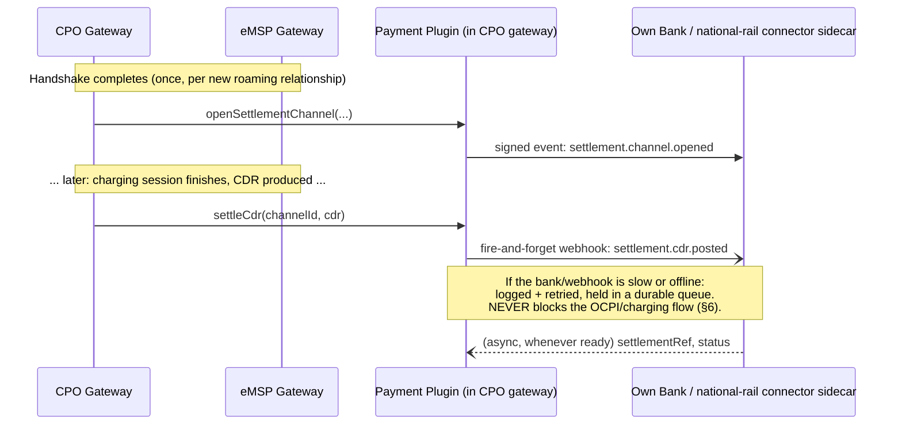

A **"sidecar"** in this diagram just means a small, separate helper process
that sits next to the main gateway and handles one specific job (here:
talking to a specific bank or payment rail) — a common pattern so the main
system doesn't need to know bank-specific details directly.

This decoupling also draws a clean security boundary: the ledger and the OCPI
roaming logic never see any bank credentials at all, and the bank-connector
sidecar never sees any of the ledger's cryptographic keys. Each component only
holds the secrets it strictly needs.

### 2.5 Who actually pays whom, and how reconciliation works

This follows directly from §1.7's role split. When a driver charges on a
third-party eMSP's app at a CPO-only operator's station, **two separate
payments** happen, in opposite directions, on completely separate rails:

1. **Driver → eMSP.** The eMSP owns the customer billing relationship, so it
   charges the driver directly, on whatever terms it wants (its own card/wallet
   flow, possibly with a markup over the CPO's wholesale price). This leg has
   nothing to do with ADERA, OCPI, or any national rail — it's just the
   eMSP's own consumer payments product.
2. **eMSP → CPO.** Separately, the eMSP owes the CPO for *hosting* that
   session — typically at the CPO's own published tariff. This is the
   "interoperator settlement" leg, and it's the one §2.1–§2.4 (the
   `PaymentPlugin` interface) actually covers.

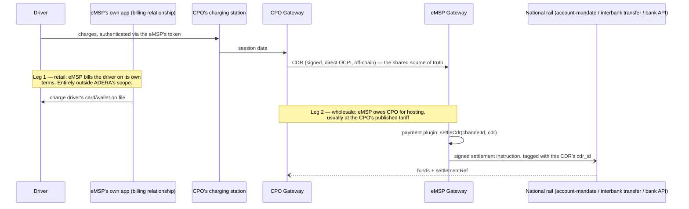

**What actually governs the reconciliation:**

- **The CDR is the shared source of truth.** Because it arrived over the
  cryptographically signed, on-chain-identity-verified OCPI channel (§4.4),
  both sides are looking at the *same* record, and neither can plausibly claim
  it came from someone else or was tampered with in transit.
- **`cdr_id` is the reconciliation key.** Each CDR's stable ID is what ties a
  specific settlement instruction (and the `settlementRef` the rail hands
  back) to a specific charging session — that pairing, kept by each
  operator's own bookkeeping, *is* the reconciliation record.
- **The ledger has zero visibility into any of this.** No amounts, no
  invoices, no dispute log — this is a direct consequence of §2.1's principle
  that payment is "a private implementation detail of each bilateral
  relationship." The regulator's auditor role doesn't extend here either: its
  only power is `auditProbe` over *identity/registry* oversight (§3.4), not
  financial disputes.
- **So what happens if a CPO claims it was never paid?** That's resolved the
  same way any commercial dispute between two counterparties is — through
  their own bilateral roaming agreement (the legal contract, not the smart
  contract), their own bank statements, and the
  `settlementRef`/`cdr_id` pairing as evidence. ADERA deliberately doesn't
  arbitrate this; it only guarantees that the CDR both sides are arguing
  about is authentic and came from a verified counterparty.
- **Timing and markup are both left open.** Nothing in the spec forces
  per-CDR settlement over periodic net/batch settlement, and nothing
  standardizes the markup an eMSP applies over a CPO's wholesale tariff —
  both are bilateral business terms, not protocol rules.

### 2.6 Where bank details come from, and who actually gets paid

§2.5 establishes *that* the eMSP owes the CPO. Three practical questions
follow, and they are the ones most likely to come up in a commercial
negotiation or a regulator's review.

#### "Emit a settlement instruction" — what that actually is, and how fast

The gateway **never touches money.** Not at any point, in any model. What
`settleCdr` does is hand a *payment instruction* — "pay party X, amount Y, for
`cdr_id` Z" — to whatever bank connector the operator already uses, and later
receive back a `settlementRef`, which is just a reference number. The funds
themselves move bank-to-bank, entirely outside this software. The gateway's
whole financial role is emitting a request and filing the receipt.

**It does not need to be real time, and usually shouldn't be.** The *CDR*
arrives in real time — that is the invoice, and it is what both sides
reconcile against. The *payment* is a separate decision, and per-session
transfers are often uneconomic: on the mock session in this repo (23.4 kWh,
billed at 1,638 currency units), a flat interbank fee of even 50 units eats 3%
of the entire transaction. Three timings are all legitimate:

| Timing | How it works | When it makes sense |
| --- | --- | --- |
| **Per CDR** | One instruction per finished session | Low volume, or a rail with negligible per-transaction cost |
| **Batched** | Accumulate CDRs, settle on a schedule (daily/weekly) | The common default — amortises fees across many sessions |
| **Netted** | Offset what each owes the other, transfer only the difference | Two operators with heavy traffic in *both* directions (§1.7's mutual-roaming case) |

This is exactly why §2.4 makes settlement decoupled and fire-and-forget: the
payment path is allowed to be slow, batched, or temporarily offline without
ever blocking a driver from charging.

#### Bank details are not on the ledger — deliberately

**No account details, ever, in any form.** This is not an omission, and
"encrypt them like the endpoint" is not a fix:

- Every admitted member holds the same consortium key (§1.5), so
  "encrypted on-chain" would mean **readable by every competitor**.
- The chain is append-only. Details published once could never be truly
  changed or erased — a serious problem for banking data.
- It would drag the ledger inside the scope of financial-data regulation, for
  no benefit.

So the ledger holds **identity**; the payment rail holds **the account**; and
the two are linked once, bilaterally. The intended seam is
`openSettlementChannel`, which runs *once* per relationship and returns a
`mandateRef`.

**A `mandateRef` is a pointer, not the data.** This distinction is the whole
trick, and it is worth being exact about. In a real account-mandate scheme
(SEPA Direct Debit, Bacs DDI and their national equivalents), the mandate
reference identifies an *authorisation already registered with a bank* — the
account details sit at the bank, and the reference is how both parties refer to
the arrangement without either one's software ever holding the underlying
coordinates. That is why "where do the bank details go?" has a satisfying
answer: for the most part, **nowhere inside ADERA**.

How much has to cross between the two operators then depends entirely on which
direction the rail moves money:

| Rail style | Who initiates the transfer | What must cross between operators |
| --- | --- | --- |
| **Pull** (account mandate) | The **payee** collects — the CPO pulls from the eMSP | **Nothing.** The eMSP registers the mandate with its own bank; the CPO holds only the reference |
| **Push** (interbank transfer, bank API) | The **payer** sends — the eMSP pushes to the CPO | The payee's identifier: ideally a rail participant ID, at worst an account number |

Where something does have to cross — the push case — the right way to move it
is down the channel the handshake has already proven.

#### Sending bank details down the proven line

Start with the problem this solves, because it is a real and expensive one.

Today, if CPO-B emails an eMSP saying *"we've changed banks, send payments to
this account instead"* — how does the eMSP know it is really them? Mostly it
doesn't. Someone calls the number on file and hopes. **Impersonating a supplier
to redirect its payments is one of the most common frauds in ordinary
business**, and a PDF on letterhead is no defence against it: a letterhead
proves only that somebody had your email address.

The ledger closes exactly that gap — not by carrying the bank details, but by
making it certain who is sending them. Step by step, for eMSP-B needing to pay
CPO-B:

1. eMSP-B looks CPO-B up in the shared directory, and gets its address plus a
   sample of what CPO-B's signature should look like (its public key).
2. eMSP-B connects and says hello. CPO-B signs its reply.
3. eMSP-B checks that signature against the directory. **Matches → genuinely
   CPO-B. Doesn't match → hang up.**
4. The line is now proven, so CPO-B sends its bank details down it.
5. eMSP-B stores them and pays.

If CPO-B later changes banks, it sends the new details down that same proven
line and every partner updates automatically — no new paperwork, no phone
calls, and no window for the fraud above.

| | Bank details in a PDF | Bank details over the proven line |
| --- | --- | --- |
| How you know it is really CPO-B | Letterhead, and someone's judgement | Signature checked against the ledger |
| Changing bank accounts | Re-paper it with every counterparty | Push once; everyone updates live |
| Stored permanently in the open | In every counterparty's files | Nowhere public |

**Steps 1–3 already work** — that is precisely what `docker compose up`
demonstrates, and what the SECURITY rejection checks in README §4 exercise.
Only steps 4–5 are missing: a small module alongside `credentials` that carries
settlement coordinates once the line is proven.


**None of this exists in the reference implementation.** To be unambiguous,
since the interface's shape invites the assumption that it does: the mock
plugins generate `mandateRef` from random bytes —

```js
const mandateRef = this.railName.toUpperCase() + '-MANDATE-' +
                   crypto.randomBytes(4).toString('hex');   // e.g. MANDATE-RAIL-MANDATE-51af0ef9
```

— and `openSettlementChannel({ localParty, remoteParty, remoteRole })` takes no
account input of any kind. Searching the whole codebase for any notion of an
account, participant, payee or bank identifier returns nothing. So the
`mandateRef` you see in the demo logs is a plausible-looking placeholder, not a
worked example of anything: it is the right *shape* for the seam, with nothing
behind it.

The direction is wrong too, not just the value. As §2.2 sets out, a real
mandate reference is **issued outside this software** — by the collecting party
or the bank, at the moment the payer signs the mandate — and then handed *to*
the gateway. A correct integration receives and stores it; it never invents
one. So `openSettlementChannel` needs it as an **input** (alongside the payee),
not as something it returns having made up. That is the same interface change
§2.6's payout models require, and it is tracked in §7.

#### Who gets paid: identity is not the same as payee

Here is the principle that makes the rest tractable:

> **The Party ID says who *did the work*. It does not say who *gets paid*.**

Keeping those two separate is what lets ADERA support the commercial
arrangements operators actually want without weakening any of §1.8's
accountability guarantees. The CDR stays attributed to the CPO that delivered
the energy — always, in every model below — while the *destination of the
funds* is a property of the settlement relationship, not of the ledger entry.

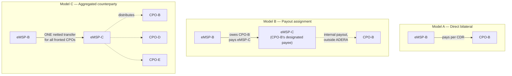

**Model A — Direct bilateral.** eMSP-B pays CPO-B directly. Simplest, and the
cleanest for accountability: money and identity follow the same path. The cost
is relationships — every CPO needs its own bank arrangement with every eMSP it
roams with, which grows as N×M.

**Model B — Payout assignment ("pay-to").** CPO-B keeps its own identity, its
own CDRs, and its own legal claim to the money, but *designates* eMSP-C as the
party to be paid. eMSP-B still owes CPO-B, still reconciles per CDR against
CPO-B, and simply routes the funds to eMSP-C's account. Legally this is
assignment of receivables — a well-understood construct, not a novel one.
**This is the direct answer to "can all payments for eMSP-C's CPOs go to
eMSP-C?" — yes, and this is the cleanest way.** Accountability is untouched
because attribution never moved.

**Model C — Aggregated counterparty settlement.** eMSP-B sends eMSP-C a single
netted payment covering every session across all of eMSP-C's fronted CPOs, and
eMSP-C distributes internally. Far fewer, larger transfers — the cheapest
option at volume, and attractive where per-transaction fees dominate. The
tradeoff is real: this recreates a small clearing house for *money*, which is
the pattern §1.1 argues against — though critically only for money, never for
identity, so CDR-level attribution and per-CPO revocation both survive intact.

| | Model A | Model B | Model C |
| --- | --- | --- | --- |
| Who is owed | CPO-B | CPO-B | CPO-B |
| Who is paid | CPO-B | eMSP-C | eMSP-C |
| CDR attribution | CPO-B | CPO-B | CPO-B |
| Bank transfers | Many, small | Many, small | Few, netted |
| eMSP-C holds others' funds | No | Briefly | **Yes** |
| Recreates hub risk | No | Minimal | For money only |

#### Two safeguards this needs, and one legal question

**The payout designation must be signed by the CPO's own governance key.**
Otherwise a hosting eMSP could unilaterally redirect its fronted CPOs' revenue
to itself, and the CPO would have no way to object or exit. The CPO must also
be able to revoke the designation the same way. This is the financial
counterpart of §1.8's rule that the CPO retains custody of its governance key:
that custody is what makes "we can switch hosting providers" a real option
rather than a stated one — it protects the revenue stream, not just the
identity.

**Attribution must never follow the money.** In every model above, the CDR
remains bound to the CPO that actually delivered the energy. The moment
settlement convenience is allowed to blur that, §1.8's non-repudiation
argument collapses and the regulator loses per-operator visibility.

**Model C likely needs a licence.** An eMSP receiving and holding funds
destined for third-party operators is, in most jurisdictions, a regulated
payment activity distinct from selling charging services — it carries float
and counterparty risk on behalf of others. This needs a legal answer before it
is offered commercially, and it is a question for the financial regulator
rather than the energy regulator.

#### What the reference implementation would need

The current `PaymentPlugin` interface (§2.3) has no way to express any of this:
`openSettlementChannel({ localParty, remoteParty, remoteRole })` assumes the
counterparty and the payee are the same party. Supporting Models B and C means
separating them — a `payee` distinct from `remoteParty`, bound once at
channel-open time and carried on the `mandateRef`, with `settleCdr` continuing
to report against the CDR's own party for attribution. That is a small,
contained change to a mock layer, but it is a genuine gap between the design
described here and the code as it stands (§7).

---

## 3. How the ledger itself is kept trustworthy: consensus & governance

### 3.1 What "Hyperledger Besu" and "EVM" mean

**Hyperledger Besu** is an open-source piece of software — an Ethereum
client — used here to run the shared ledger. **EVM (Ethereum Virtual
Machine)** is the standardized computing environment Ethereum-family software
uses to run small programs called **smart contracts**: code that lives on the
ledger and whose rules (e.g., "only admit a new operator if enough existing
members vote yes") are enforced automatically by every node, rather than by
any one party's discretion. ADERA's registry logic (§3.5) is one such smart
contract, called `AderaRegistry`.

Using "enterprise EVM" software like Besu, rather than the public Ethereum
network, is what makes this **permissioned**: a private, invite-only version
of the same technology, not connected to or dependent on the public
cryptocurrency network at all.

### 3.2 What "QBFT" and "proof-of-authority" mean, and why it matters to a regulator

Public blockchains like Bitcoin use **proof-of-work**: anonymous participants
("miners") compete by burning huge amounts of electricity to earn the right
to add the next block of transactions. ADERA does none of that.

**QBFT (Quorum Byzantine Fault Tolerant)** is a **proof-of-authority**
consensus algorithm: a fixed, known set of **validators** (here, the founding
and later-admitted operators themselves) take turns proposing blocks, and a
**quorum** (a large-enough majority of them) must sign off before a block is
accepted. Two properties fall out of this that matter a lot to a regulator:

- **Immediate finality.** In proof-of-work systems, a block can technically
  get "reorganized" (undone and replaced) for a while after it's produced,
  which is why exchanges make you wait for several confirmations. QBFT
  blocks are final the instant they're produced — no reorganizations, ever.
  So the moment an admission or revocation is recorded, it's permanently
  settled.
- **No anonymous block producers, no energy cost.** Only the known,
  vetted validator set can produce blocks — there's no possibility of an
  anonymous outside miner taking over, and no proof-of-work electricity bill.

### 3.3 What a smart contract "multisig" vote actually looks like

**Multisig ("multi-signature") admission** means no single person or company
can unilaterally add or remove a market participant — it requires an
**M-of-N vote**: M signatures/confirmations out of N total existing members,
where the threshold M is itself set by governance.

```mermaid
sequenceDiagram
    participant Proposer as Existing Member (proposer)
    participant M2 as Existing Member #2
    participant M3 as Existing Member #3
    participant Reg as AderaRegistry (smart contract)
    participant New as New Operator

    Proposer->>Reg: proposeAdmitParty(XX, XXX, role, entity, endpointCipher, pubKey)
    Reg-->>Proposer: proposalId created (auto-confirmed by the proposer)
    M2->>Reg: confirm(proposalId)
    M3->>Reg: confirm(proposalId)
    Note over Reg: confirmations reached threshold (e.g. 2-of-3)
    Reg->>Reg: bind Party ID 1:1 to entity key;<br/>record endpoint + pubKey; mark active
    Reg-->>New: PartyAdmitted event — now admitted AND a governance member
```

The exact same M-of-N mechanism (not a separate system) also governs
revoking a party, reinstating one, adding/removing a governance member,
changing the threshold itself, and transferring the regulator's key
(explained next). "**No single key can unilaterally admit, remove, or
impersonate a participant**" is the point — this is what turns "a company
runs the directory" into "the market collectively runs the directory, under
rules the regulator has approved."

### 3.4 The regulator's role: read-only auditor

ADERA gives the national regulator — whichever authority licenses and
oversees charging operators in a given market — a dedicated cryptographic
key, the **auditor key**, with a very specific, deliberately narrow power:

- The regulator can **read absolutely everything** on the ledger, and every
  governance action (a new admission, a revocation, a key rotation, a
  membership change) fires an **event** — a structured, timestamped log entry
  any observer can subscribe to in real time. It can run its own copy of the
  ledger node (an **"observer node"**) specifically to watch this feed
  independently, without needing to ask any operator's permission.
- It **cannot change anything**. The auditor key has exactly one
  state-changing action available to it: `auditProbe(partyKey, note)`, which
  writes an immutable, timestamped note to the ledger saying "the regulator
  looked at this party on this date" — a way to *prove oversight was
  exercised* without ever being able to *distort the market* by admitting,
  blocking, or altering any operator itself.
- Because the regulator is only ever reading, the network's normal operation
  never depends on its node being online. If the regulator's server has an
  outage, roaming keeps working; its oversight just resumes once it's back.

If the regulator ever needs to move the auditor key to new hardware (say,
migrating to a new **HSM** — a **Hardware Security Module**, a
tamper-resistant physical device purpose-built to store cryptographic keys so
they can never be extracted, even by whoever has physical access to the
machine — or responding to a suspected compromise), that handover is itself a
logged, governed `TransferAuditor` action — visible in the same audit trail as
everything else.

### 3.5 The lifecycle, end to end

```mermaid
stateDiagram-v2
    [*] --> Genesis
    Genesis: Genesis — founding CPO + founding eMSP seeded as parties AND governance members; threshold set (e.g. 2-of-N); the regulator's auditor key installed
    Genesis --> Admission
    Admission: Admission — existing members propose + confirm a new operator (M-of-N vote); new Party ID bound 1:1 to its entity
    Admission --> Operation
    Operation: Operation — operators self-service rotate their OWN endpoint / messaging key (logged); the identity binding itself stays fixed
    Operation --> Oversight
    Oversight: Oversight — the regulator observes all events continuously; may emit ComplianceProbe attestations
    Oversight --> Operation
    Oversight --> Revocation
    Revocation: Revocation — on breach or exit, members vote to revoke; party becomes inactive, loses its governance vote, is dropped from the network allowlist
    Revocation --> [*]
```

"**Identity binding (1 entity : 1 Party ID)**" means: once `XX/CPO` is bound
to a specific company's governance key, that pairing can never be
reassigned to a different key while active — the only way to break the link
is a full governed revocation, never a quiet edit.

---

### 3.6 Who actually runs the validators, and what it costs

"Who runs the ledger?" is the first question a regulator asks, and until now
this guide has only said "the founding operators, extended by governance."
That is not an answer. This section gives one.

#### Running a validator and being a member are different things

These are two separate mechanisms that happen to coincide in the sandbox, which
makes them look like one:

| | Validator set | Governance membership |
| --- | --- | --- |
| Decides | Who produces blocks | Who votes to admit and revoke parties |
| Lives in | Besu / QBFT | The `AderaRegistry` smart contract |
| Changed by | A QBFT validator vote | A multisig proposal |
| Needed to participate in roaming? | **No** | Yes |

The reference deployment proves the distinction: **LK/EVX** is admitted by
multisig, becomes a full governance member with a vote on future admissions,
and runs **no validator and no gateway at all**. Membership went from two to
three while the validator count stayed at two. Most participants in a mature
network will look like EVX — they hold an identity, not infrastructure.

#### What a validator can and cannot do

This bounds how much the question matters. Validators **order transactions**.
That is the whole of their power. A colluding majority of them could stall the
network or refuse to include a transaction. They **cannot**:

- forge any party's identity — that needs that party's private key;
- admit, revoke or alter any party — that needs the multisig;
- read anything private — they see exactly the public data everyone else sees.

So validator power is **liveness, not authority**. A thin or partly self-
interested validator set can slow the network down; it cannot rewrite who
anyone is, or quietly let an unlicensed operator in. That is a materially
weaker threat than "whoever runs the infrastructure controls the market," and
it is the reason a modest validator count is tolerable.

#### The recommended model: every eMSP runs a validator + gateway pair

The natural fit, and the one the reference deployment already implements:
**each eMSP runs one validator and one gateway, co-located**, and fronts however
many CPOs it has commercial relationships with (§1.8).

This follows directly from the project's own reasoning. §1.7 observes that CPOs
are hardware businesses rather than software ones; §1.8 concludes they should
outsource hosting to a fronting eMSP. If a CPO will not run a gateway, it
certainly will not run a ledger node — so the eMSPs, who are already the
software-operating parties, are where the infrastructure belongs.

Three properties make the pairing worth keeping together:

- **Outage tolerance.** Each gateway reads the chain from its *own* co-located
  validator, so ledger reads survive an internet outage as long as the local
  node is up (§6.2). A gateway that depended on a competitor's node would lose
  discovery the moment that link dropped.
- **No dependency on a rival.** An operator never has to ask a competitor's
  infrastructure to confirm who its counterparties are.
- **Skin in the game.** The parties benefiting from the network are the ones
  keeping it alive.

Sizing follows from QBFT's Byzantine fault tolerance, which needs
`3f + 1` validators to survive `f` failures:

| Validators | Survives | Comment |
| --- | --- | --- |
| 2 | **0** | The sandbox. Both must be up. Demonstration sizing only |
| 4 | 1 | The practical production minimum |
| 7 | 2 | Comfortable for a national network |
| ~20+ | — | QBFT messaging is O(n²); block times degrade well before this |

In a small national market with a handful of eMSPs, four to seven
validators is both achievable and correctly sized. If the eMSP count is ever
below four, the gap is best filled by neutral parties — the regulator, a bank, an
industry association, a university. **Validators need not be operators at all**;
QBFT only requires known, vetted nodes.

#### Is the validator the same software as the gateway? No

They are entirely different programs, and it matters for who can run what:

| | Validator | Operator gateway |
| --- | --- | --- |
| Software | **Hyperledger Besu** — third-party, open source, off the shelf | `gateway/gateway.js` — custom to this project |
| Language | Java | Node.js |
| Image | `hyperledger/besu:24.12.0` | `adera/operator-gateway:1.0.0` |
| Written here? | **No** — only *configured* (`network/`) | Yes |
| Talks to | Other validators (peer-to-peer) | Its own validator, over JSON-RPC |

Nobody is being asked to run bespoke consensus code. The ledger half is a
widely deployed open-source Ethereum client; this project contributes a genesis
file, an allowlist, and a launch script. The custom code is confined to the
gateway.

#### What it actually costs to run

Besu's private-network guidance is a minimum of **4 GB of JVM memory** and
SSD/NVMe storage. That number is a headroom recommendation for a private chain
carrying real state and real traffic, not a floor — the same page notes that
requirements peak during sync and tells you to measure your own workload. The
very large disk figures sometimes quoted (750 GB, and currently ~1.14 TB for
snap sync with Bonsai) are **Mainnet** numbers; Besu's private-network page asks
for 10 GB, 20 GB recommended. ADERA's workload is about as light as an EVM
workload gets: an empty world state, one registry contract, and a few dozen
storage slots.

**Measured, not estimated.** Running this repository's sandbox — two validators,
two gateways, a block every two seconds:

| Process | Measured |
| --- | --- |
| Validator (Besu, JVM) | ~720 MiB |
| Gateway (Node.js) | ~21 MiB |
| Besu data directory | 75 MB on disk, of which **0.7 MB is actual chain data** — the rest is RocksDB's preallocated write-ahead log |

The validator's ~720 MiB is an artifact, not a requirement. With no `-Xmx` set,
the JVM sizes its maximum heap at 25% of visible RAM — on an 8 GiB host that is
a 1.9 GiB ceiling, and a garbage collector under no memory pressure has no
reason to hand anything back. Give the process a smaller box and it sizes itself
down. The same QBFT validator, run under hard container memory limits:

| Container limit | Heap | Steady state | Producing blocks? |
| --- | --- | --- | --- |
| 1 GiB | `-Xmx512m` | ~560 MiB | Yes |
| 768 MiB | `-Xmx384m` | ~430 MiB | Yes |
| 512 MiB | `-Xmx256m` | ~395 MiB | Yes |
| 384 MiB | `-Xmx192m` | ~345 MiB | Yes |
| 1 GiB | *untuned* | ~430 MiB — the JVM picked a 256 MiB heap by itself | Yes |

No OOM kills and no restarts in any of them. Besu's non-heap floor — metaspace,
JIT code cache, thread stacks, RocksDB block cache, Netty buffers — measures at
**110–120 MiB**; everything above that is heap you chose to grant it.

Which makes the honest per-operator sizing:

| | |
| --- | --- |
| Validator, given a generous 1 GiB heap ceiling | ~1.2 GiB |
| Gateway | ~0.1 GiB |
| OS, container runtime, log shipper, monitoring agent | ~0.5 GiB |
| **Working total** | **~1.8 GiB** |

**4 GiB is the right production line; 8 GiB is roughly double what this needs.**
The headroom is not for steady state — it is for the one operation that
genuinely costs memory, a new node joining in year five and replaying the whole
chain from genesis, plus the permissioning sidecar (§7), TLS termination, and
whatever else the operator co-locates.

One caveat worth stating plainly: the figures above are an idle registry chain.
The two things that would move them are a transaction pool saturated under
sustained load and wide `eth_getLogs` scans across a long chain. ADERA's ledger
has neither by design (§1.3) — but a *gateway* fielding heavy OCPI traffic is a
separate sizing question from the validator, and should be sized on its own.

**One caveat dominates storage, and it is a configuration choice rather than a
workload one.** `network/genesis.json` sets `blockperiodseconds: 2`, so the
chain produces a block every two seconds *whether or not anything happened* —
roughly 15.8 million mostly-empty blocks a year. An empty block on this chain
measures 735 bytes on the wire and about **1.45 KB of write volume** once Besu
has stored the header, the body, the receipts and its indexes. That is ~23 GB
written per year at a two-second period (less once RocksDB compacts and
compresses what are nearly identical headers), against ~3 GB at fifteen
seconds. For a registry that sees a handful of admissions a month, two-second
finality buys nothing. Raising the block period to 15 seconds cuts block
production — and the storage that follows it — about sevenfold, and costs
nothing anyone would notice. **This is a change worth making before any
production deployment**, and it is not currently reflected in the genesis file.

Indicative cost for one operator running a co-located validator + gateway on
AWS, sized generously, in an Asia-Pacific region (Singapore/Mumbai carry roughly
a 20–30% premium over US regions):

| Item | Spec | Approx. per month |
| --- | --- | --- |
| Compute | `t3.medium` — 2 vCPU, 4 GiB | ~$38 |
| Storage | 100 GB `gp3` SSD | ~$10 |
| Snapshots / backup | | ~$5 |
| Data transfer | Minimal at this volume | ~$5 |
| **Total** | | **~$58** |

Notes: `t3.medium` is burstable, which suits a workload that is idle between
blocks; step up to `m5.large` (~$90 compute) if you would rather have
non-burstable CPU, or to `t3.large` (~$75) if you want the 8 GiB anyway. 100 GB
of storage is four to five years of runway at the current two-second block
period, and thirty-plus at fifteen seconds — 50 GB (~$5) is defensible once the
block period is fixed. A one-year reserved instance or savings plan removes
roughly 30–40%. The gateway container is small enough to share the instance.
**Verify against the AWS pricing calculator before budgeting** — these are
indicative figures, not quotes.

This sits consistently inside §1.8's estimate that a lean operator setup lands
in the low hundreds of dollars a month once a WAF, load balancer, KMS, backups
and monitoring are added on top.

#### Can an operator join with one prebaked container, once the regulator approves?

That is the right target, and it is **half built**.

**Already works:** admission itself. An existing member proposes the newcomer,
the multisig approves, and the party is live in the registry — demonstrated
end to end every time the sandbox runs. The gateway is a single env-driven
image; the validator is stock Besu plus config files.

**Still manual, and this is the blocker:**

1. **Node permissioning.** Every existing node's allowlist must include the
   newcomer's enode before it can peer at all. Today `permissions_config.toml`
   is a hand-edited file on each node. §7 already records the missing piece: a
   sidecar that watches `PartyAdmitted` / `PartyRevoked` and rewrites the
   allowlist automatically. **Until that exists, self-service onboarding is not
   possible**, because joining requires every incumbent to edit a file.
2. **Bootstrap details.** `static-nodes.json` hardcodes two fixed container IPs.
   A real network needs a published genesis file and a stable, DNS-based
   bootnode list.
3. **Becoming a validator** additionally requires a QBFT validator vote by the
   existing validators — separate from the registry multisig, and not currently
   wired to it.

So the honest position: the *governance* half of onboarding is built and
demonstrable; the *network* half is manual. Closing items 1–3 is what turns
this into "the regulator approves you, and you run one container."

---

## 4. How impersonation is actually prevented

*Corresponds to Part 2 of `02-System-Architecture-Security-Design.md`.*

### 4.1 Defense in depth

**Defense in depth** is a security-engineering principle: instead of relying
on one strong wall, you build several *independent* barriers, so that a flaw
or breach in any single one still leaves the attacker facing the others. Here
are ADERA's eight layers, in the order a connection attempt or a malicious
message would actually hit them:

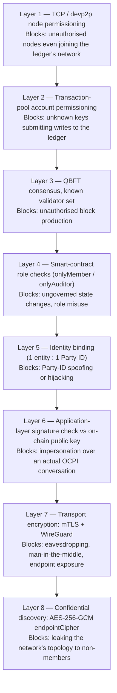

An attacker has to defeat **every** layer relevant to what they're trying to
do — not just one.

### 4.2 Layers 1–3: keeping unauthorized computers off the network at all

A node here means "a computer running the Besu ledger software." Layers 1–3
stop a stranger's computer from even participating in the network's
low-level conversations:

- **Layer 1 (node permissioning).** Ledger nodes find and talk to each other
  using a peer-to-peer networking protocol stack called **devp2p**, over the
  network transport **RLPx**. Each node has a unique network identity called
  an **enode** (essentially: its public key plus its IP address and port). A
  file (`permissions_config.toml`) contains the *authoritative allowlist* of
  enodes permitted to connect at all — an unlisted node's connection attempt
  is dropped during the initial handshake, before any real data is even
  exchanged. Ordinarily, peer-to-peer networks let nodes discover each other
  automatically via a **DHT** (Distributed Hash Table — think of it as a
  shared address book nodes build collaboratively); here that automatic
  discovery is turned off entirely (`discovery-enabled=false`), so there's
  no way for an unknown node to advertise itself into the network at all —
  connections only happen via the explicit allowlist.
- **Dynamic projection.** In production, that allowlist file isn't edited by
  hand. A small helper program (again, a "sidecar") on each operator's
  infrastructure watches the ledger's `PartyAdmitted` / `PartyRevoked` events
  and automatically rewrites the local allowlist to match — so a governance
  vote to admit or revoke someone *is* the same act as granting or removing
  their network access, with no separate manual step to fall out of sync.
- **Layer 2 (account permissioning).** Even a computer that *is* allowed to
  connect can't submit a ledger-writing transaction unless its cryptographic
  key is also on a separate allowlist. Only governance keys and the
  regulator's auditor key can originate any state change at all.
- **Layer 3 (consensus).** Covered in §3.2 — only the known validator set can
  actually produce blocks.

### 4.3 Layers 4–6: stopping identity theft and fake operators

Imagine an attacker — call her "Mallory" (a standard placeholder name in
security writing for an active attacker) — who wants to either register as an
operator she isn't, hijack an existing Party ID to steal that operator's
sessions/bills, or flood the registry with fake identities to gain outsized
voting power (called a **Sybil attack**, named after a case study about a
person with multiple personalities — in security, it means "one attacker
creating many fake identities to overwhelm a system that assumes one identity
= one real participant").

The smart contract enforces a strict **1:1 binding**: one legal entity's key
maps to exactly one Party ID, permanently, unless formally revoked.

```
mapping(bytes32 => Party)   parties;        // partyKey -> record (must be unique)
mapping(address => bytes32) entityToParty;  // entity   -> partyKey (must be unique)
```

(A **mapping** here is just a lookup table — like a dictionary or hash map in
any programming language: give it a key, get back the associated record.)
Two rules fall out of this:

- **No duplicate Party IDs.** Once `XX/CPO` is registered, a second attempt to
  register the same ID is simply rejected by the smart contract's own logic.
- **No unauthorized changes.** Rotating an operator's endpoint or public key
  is only allowed if the request is signed by *that exact operator's own
  entity key* (`msg.sender == party.entity` — `msg.sender` is blockchain
  terminology for "whichever key actually signed and submitted this
  transaction"). Mallory cannot redirect `XX/CPO`'s traffic to her own
  servers because she doesn't hold `XX/CPO`'s key, full stop.

As for Sybil attacks: there is no open self-signup. A new Party ID only enters
via the M-of-N governance vote from §3.3, and each of those governance
members is itself a **licensed legal entity** — that licensing is
established *off-chain*, by the regulator, through normal legal/business
vetting. So creating fake identities on-chain would first require creating
fake *licensed companies* and then convincing a majority of real competitors
to vote them in — which the whitepaper correctly frames as a legal/governance
barrier, not a technical one the software alone can solve.

### 4.4 Layer 6 in full: proving "I actually hold this key, right now"

The binding in §4.3 proves *which key is allowed to speak for* a Party ID.
Separately, every time two operators actually start talking, the receiving
side must confirm *the other end genuinely controls that key at this exact
moment* (not, say, replaying an old stolen message).

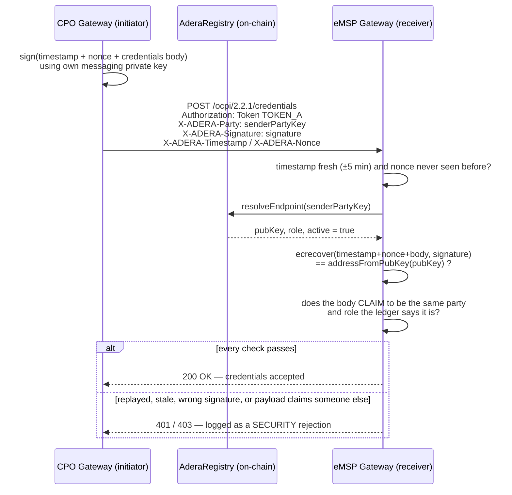

A few terms worth unpacking:

- **`ecrecover`** is a standard cryptographic operation (originally from
  Ethereum) that takes a message and a digital signature and mathematically
  *recovers* the public key/address that must have produced that signature —
  without the signer ever having to reveal their private key. It's the
  verification half of the sign/verify pair described in §1.4.
- **EIP-191** is simply a standardized, specific *format* for what exactly
  gets signed (so that a signature produced for one purpose can't accidentally
  be replayed as valid for a different purpose) — an "Ethereum Improvement
  Proposal," essentially a numbered, agreed-upon convention.
- **`TOKEN_A`** is a detail carried over from plain OCPI: normally OCPI's
  *only* protection is a shared secret token — if that token ever leaks
  (e.g., in a log file, or over an insecure channel), anyone who has it can
  impersonate that operator completely. ADERA doesn't remove the token (for
  compatibility) but makes it insufficient on its own: even with a stolen
  token, an attacker still can't produce a valid signature without also
  possessing the private key — and *that* key's authority traces directly
  back to the on-chain binding from §4.3.

### 4.5 Layers 7–8: protecting the actual conversation and hiding the map

- **Layer 8 — confidential discovery.** As covered in §1.5: `resolveEndpoint()`
  never returns a plain-text address, only the AES-256-GCM-encrypted
  `endpointCipher`. Only members holding the shared consortium decryption key
  can turn it back into a usable address.
- **Dynamic routing.** A gateway keeps **no static list of who to talk to** —
  every single time it needs to reach a peer, it re-reads the ledger live:
  computes the peer's Party ID, calls `resolveEndpoint`, checks `active`
  (instantly refusing to talk to a peer the instant it's been revoked — no
  stale cached address to exploit), decrypts the address, and only then runs
  the signed handshake from §4.4. The practical benefit: a governance
  decision (like a revocation) takes effect network-wide immediately, with no
  need to redeploy or manually reconfigure any operator's software.
- **Layer 7 — transport encryption.** Two independent protections wrap the
  actual data connection between two operators' gateways:
  - **WireGuard** — a modern VPN (Virtual Private Network) protocol. It builds
    a private, authenticated tunnel between the two gateways so their traffic
    never crosses the open internet in a form anyone else could read, and
    neither gateway's raw address needs to be exposed to the public internet.
  - **mTLS (mutual TLS)** — ordinary HTTPS (**TLS**) only proves the *server's*
    identity to the client (the padlock in your browser). **Mutual** TLS
    additionally has the client present its own certificate, so *both* sides
    prove who they are before any data flows. Here, the certificate's
    underlying key is the *same* messaging identity that's bound on the
    ledger — so passing the mTLS check and passing the on-chain identity
    check are, by construction, the same fact, closing the gap a
    man-in-the-middle attacker would otherwise try to exploit.

> The reference implementation currently runs this channel over plain HTTP on
> an isolated internal Docker network, specifically so it can be run and
> demonstrated with zero certificate setup. The signature check (§4.4) and
> the encrypted endpoint (§4.5) are fully implemented already; WireGuard/mTLS
> are documented as how this same channel gets wrapped for a real production
> deployment — the identity/signing groundwork is already there, so enabling
> it is a deployment configuration step, not new code.

---

## 5. What happens when the power or the internet drops

Real-world grid instability and intermittent connectivity are common in many
markets, so this is treated as a first-class design concern, not an edge
case.

### 5.1 A ledger node loses power and restarts

Because QBFT gives **immediate finality** (§3.2), there's no "in-progress,
not-yet-final" state that could be corrupted by a crash. Each validator saves
its copy of the ledger to persistent storage continuously, so after a restart
it simply reloads, reconnects to its allowed peers, and picks up exactly
where it left off — nothing is rewritten or lost. And because consensus only
needs a **quorum** (a large-enough majority), not literally every single
validator, the loss of any one site doesn't halt the whole network — the
whitepaper specifies a minimum of four validators in production for exactly
this reason (a small two-validator test setup has zero fault tolerance by
design, since losing either one leaves no majority).

### 5.2 The internet drops for a while

An already-established, already-verified connection between two operators can
keep going — the ledger only needs to be re-consulted to *start* a brand-new
relationship, or to notice a revocation. So a temporary dropout delays
*discovering new peers*, but doesn't interrupt an *existing* charging session
already in progress. Each gateway also talks to its **own**, co-located
ledger node over a local/internal network rather than the public internet, so
gateway-to-ledger reads keep working even during a wider internet outage, as
long as that local node itself is up.

### 5.3 No CDR (bill) is ever silently lost

A CDR is the record of what a driver owes for a specific charging session —
losing one means an operator simply doesn't get paid for a real session that
happened. So every gateway keeps a **durable, order-preserving offline
queue** — "durable" meaning it's saved to disk, not just kept in memory, so a
crash doesn't wipe it out; "order-preserving" meaning items are processed in
the order they arrived, never reshuffled.

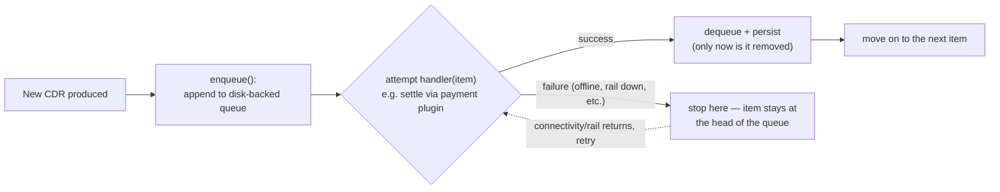

A couple of standard reliability terms worth defining here:

- **At-least-once delivery** means the system guarantees a message will be
  delivered *eventually*, possibly by retrying — which also means a receiver
  might, in principle, see the same message more than once if a retry happens
  right after a success that wasn't acknowledged in time.
- **Idempotency** is the fix for that: each CDR carries a stable, unique
  `cdr_id`, so if the bank connector ever receives what's technically a
  duplicate retry, it can recognize it and avoid charging twice — turning
  "at-least-once delivery" into "effectively-once settlement" from the
  driver's and operator's point of view.
- **Backpressure** describes what happens when a downstream system (here, a
  bank) can't keep up with the rate work arrives. Because settlement runs
  through the decoupled webhook pattern from §2.4, a backlog piling up in this
  queue never "backs up" into and stalls the actual charging/roaming system —
  the two are isolated from each other by design.

---

## 6. Putting it all together: one full charging session, start to finish

This composite walkthrough traces a single real-world event — a driver who is
a customer of eMSP "X" charges at a station belonging to a different company,
CPO "B," whom eMSP X has never dealt with before — through every layer
covered above.

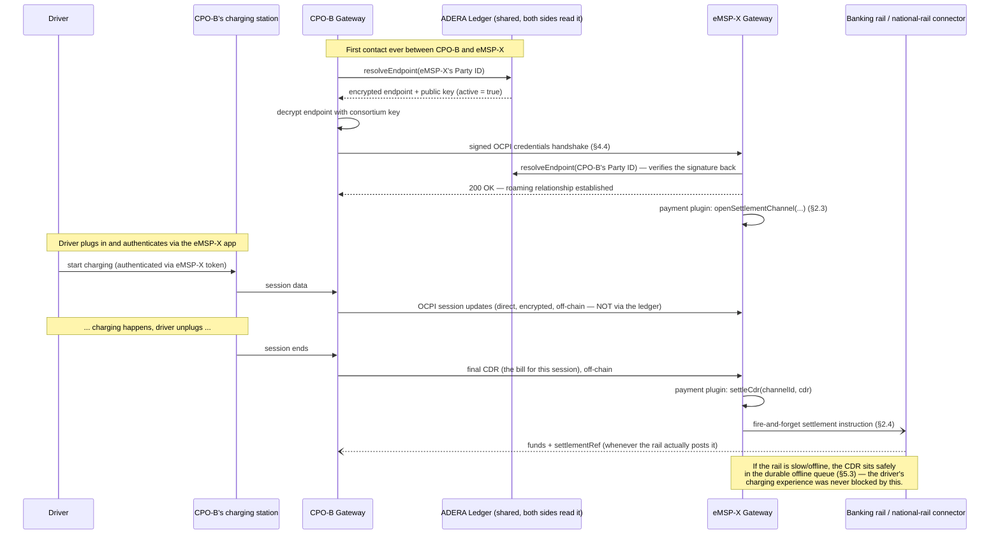

Two clarifications this diagram is easy to misread:

- **Who initiates the handshake vs. who initiates the roaming.** §1.7's rule
  that the roaming conversation always runs eMSP-role → CPO-role describes the
  *operational* flow: the eMSP vouches for a driver, the CPO delivers energy.
  The one-time credentials handshake in phase 0 is different — plain OCPI
  permits *either* side to open it, and here CPO-B does, because it is the side
  that has just been handed a registration token. Both readings are correct;
  they describe different moments.
- **Who pays whom.** The money leg above runs eMSP → CPO, matching §2.5. Note
  that the reference implementation currently drives `settleCdr` from the
  **CPO** gateway instead, because the CPO is the demo's initiator and the
  payment plugin is a mock with no notion of direction. That is a proof-of-
  concept artifact, not the intended economic model (§7).

Notice what the ledger was actually used for in this entire story: **exactly
two read operations**, both purely to look up an address and a public key.
Everything else — the actual charging, the bill, the payment — happened
directly between the two companies and their own bank, off-chain, exactly as
the whitepaper's core thesis in §1 describes.

### 6.1 Which protocol carries which step: OCPP vs OCPI vs the ledger

The single most useful thing to hold onto is that **three different systems
each own a different stretch of the journey, and they never overlap**:

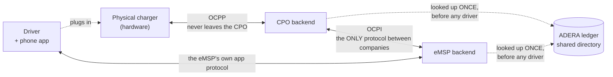

- **OCPP (Open Charge Point Protocol)** is how a charging post talks to *its
  own operator's* backend. It is internal plumbing: it never crosses a company
  boundary, and it is not part of ADERA at all. No OCPP appears anywhere in
  this repository.
- **OCPI (Open Charge Point Interface)** is how two *companies* talk. This is
  the only inter-company protocol in the whole design.
- **The ledger** is consulted at neither of those moments. It answers one
  question — *"is this company real, where do I reach them, and what does their
  signature look like?"* — before the two companies have ever spoken. Think of
  it as a shared phone book that no single company owns and in which nobody can
  forge an entry.

Walking one full session through, for a driver whose app is **eMSP-B**,
charging at a station run by **CPO-B**:

| Phase | What happens | Protocol | Direction | What is actually shared |
| --- | --- | --- | --- | --- |
| **0. Introduction**<br/>*once, ever* | The two companies establish a roaming relationship: ledger lookup, then a signed credentials handshake exchanging API tokens | Ledger read, then **OCPI** `credentials` | eMSP-B ⇄ CPO-B | Public identity, public key, encrypted endpoint, API tokens. No driver exists yet |
| **1. Catalogue**<br/>*continuous background* | CPO-B publishes where its chargers are, which are free, and what it charges | **OCPI** `Locations`, `Tariffs` | CPO-B → eMSP-B | Station locations, availability, prices. Nothing driver-related |
| **2. Authorisation**<br/>*driver arrives* | Either the driver taps a card (charger asks CPO, CPO asks eMSP-B "is this token good?") or presses start in the app (eMSP-B tells CPO to start) | **OCPP** `Authorize` internally, **OCPI** `Tokens` or `Commands` between companies | CPO-B ⇄ eMSP-B | **A token/contract ID and a yes/no.** Not the driver's name, card, or address |
| **3. Charging**<br/>*live* | Meter readings flow up from the hardware; the eMSP is kept updated so its app can show live kWh and running cost | **OCPP** `MeterValues` internally, **OCPI** `Sessions` between companies | CPO-B → eMSP-B | Energy delivered so far, elapsed time, running cost |
| **4. Completion**<br/>*driver unplugs* | The charger reports the final reading; CPO-B computes the bill and sends it as a **CDR** — final, immutable, and the shared source of truth both sides reconcile against | **OCPP** `StopTransaction` internally, **OCPI** `CDRs` between companies | CPO-B → eMSP-B | Total kWh, duration, tariff applied, total cost, and a stable `cdr_id` |
| **5. Money** | Two separate legs — see §2.5 and §2.6 | Not OCPI at all; a banking rail | eMSP-B → CPO-B | Nothing new; keyed by the `cdr_id` from phase 4 |

Two things worth drawing out:

- **The driver's personal data never reaches the CPO.** In phase 2 the CPO
  learns "this is *some* valid eMSP-B customer" and nothing more. The eMSP
  vouches; the CPO doesn't need to know who for.
- **The ledger was read exactly twice, both in phase 0, both read-only.**
  Once two operators know each other, every subsequent session — thousands of
  them — touches the chain zero times. This is the whole reason the design
  scales without the ledger becoming a bottleneck, and the concrete meaning of
  §1.3's "operational data never goes on-chain."

**What of this exists in the repo:** phase 0 is fully implemented and is what
`docker compose up` demonstrates. Phase 4 has a stub receiver that logs a CDR
and returns `{accepted:true}`. Phases 1, 2 and 3 are design-only — `Locations`,
`Tariffs`, `Tokens`, `Sessions` and `Commands` are not built (§7). That is
consistent with the repo's stated purpose: it is a proof of ADERA's
identity/discovery/settlement layer, not a full OCPI server.

### 6.2 Where a CPO could still cheat

It's tempting to think tariff transparency closes the loop entirely: the
eMSP receives the CPO's published rates over OCPI, shows them to the driver,
the driver approves, and everything downstream settles against a bill
computed at that already-agreed rate. That reasoning is half right — it
closes exactly one gap, **price manipulation**. A CPO can't quietly charge a
different rate than what it published, because the rate was exchanged in
advance over a channel cryptographically tied to its identity (§4.4): if a
final CDR's price-per-unit doesn't match the tariff the same CPO published
earlier, that mismatch is provable and non-repudiable.

What it does **not** close is **quantity manipulation** — how much energy was
actually delivered, and for how long. That number never comes from OCPI, the
ledger, or any cryptography. It comes from the CPO's own backend, reading its
own meter, after the session ends, with nothing downstream independently
observing the physical event. A dishonest CPO can apply the correct,
publicly-published rate to an inflated kWh or duration figure, and every
check described in this document — the signature, the identity binding, the
tariff match — passes cleanly, because none of them were ever designed to
verify *quantity*, only *identity* and *published price*.

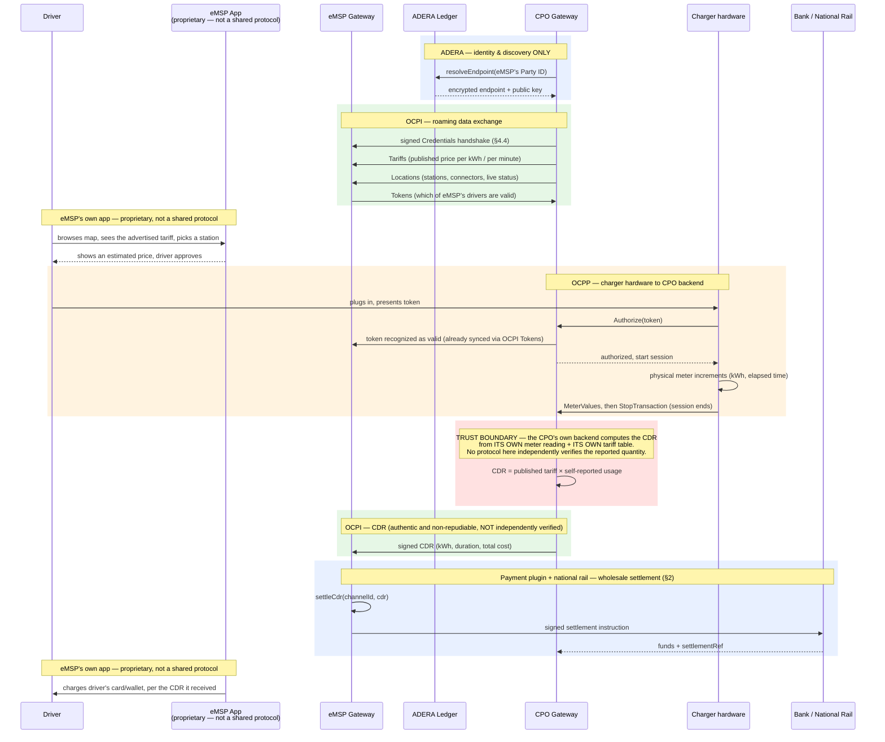

**So, can a CPO actually cheat?** Not on *price* — that's pinned down by the
cryptographically-signed tariff exchange and would be a provable, immediate
breach. But yes, on *quantity* — a CPO's backend could report more energy or
time than a session actually used, at the correct rate, and nothing in OCPI,
ADERA, or the payment layer would catch it, because none of them ever
observe the physical charging event directly. This isn't a gap specific to
ADERA's design — **no roaming protocol, blockchain-based or not, solves
this**, because it's fundamentally a metering-integrity problem (is the
charger's own meter honest and tamper-evident?), which is a legal-metrology
and hardware-certification question, not a software or cryptography one. The
practical mitigations are outside this stack entirely: certified,
tamper-evident meters, physical/regulatory audits of charging hardware, and
the commercial/legal consequence of a licensed operator getting caught —
backed by the fact that a fabricated CDR is, thanks to §4.4's signing, an
unambiguous, non-repudiable piece of evidence against the CPO if it ever gets
disputed.

---

## 7. What's actually implemented vs. described

Everything above describes the *design* — what the whitepaper and
architecture doc specify. It's worth being precise about which parts of that
design actually exist as working code in this repo, and which are described
as the production target but aren't built yet. Verified directly against the
source, not assumed from the docs.

**Matches closely, verified line-by-line:**

- `contracts/AderaRegistry.sol` mirrors the whitepaper almost exactly — the
  `Role` enum, the 1:1 `entityToParty` binding, the propose/confirm/execute
  multisig flow, the auditor's `auditProbe`-only power, every event name.
- The signed handshake (`gateway/lib/crypto.js` + `ocpi.js` + `replayGuard.js`
  + the `/credentials` route in `gateway.js`) implements §4.4 precisely:
  EIP-191 signing over timestamp ‖ nonce ‖ body, a ±5-minute freshness window,
  a single-use nonce, the recovered signer checked against the on-chain
  `pubKey`, and the payload's declared party *and role* checked against the
  ledger — each failure a 401/403 with a `SECURITY`-tagged log line. Headers
  are `X-ADERA-Party`, `X-ADERA-Signature`, `X-ADERA-Timestamp`,
  `X-ADERA-Nonce`.
- The encrypted endpoint (`iv‖tag‖ciphertext` AES-256-GCM) matches
  §1.5/§4.5 exactly.
- Dynamic routing (`registry.js`: no static peer table, live `resolveEndpoint`
  on every handshake) matches §4.5/§5.2.
- The offline queue (`offlineQueue.js`: disk-persisted FIFO, halts at the
  failed item) matches §5.3 exactly.
- `contracts/deployer/deploy.js` is the script that produces the exact
  governance lifecycle in §3.5 — genesis founders, third-party admission by
  multisig, a `ComplianceProbe` attestation.
- `network/permissions_config.toml` implements the two-tier node/account
  allowlist from §4.2 correctly.

**Honestly disclosed gaps** (the README's own "Notes & caveats" section flags
these): plain HTTP instead of mTLS/WireGuard, throwaway `.env` test keys
instead of real HSMs, 2 validators with zero fault tolerance, and payment
rails that log/webhook a mock event rather than touching a real bank. The
code matches that admission — no surprises.

**Gaps that aren't flagged anywhere:**

1. **The node-permissioning sidecar doesn't exist.** Both docs (and the TOML
   file's own comments) describe production allowlist projection as
   automatic — a sidecar watching `PartyAdmitted`/`PartyRevoked` and
   rewriting the allowlist live (§4.2). There is no such service in this
   repo. The allowlist is a static, hand-written file for the two genesis
   validators only.
2. **The regulator doesn't run anything.** §3.4 and the whitepaper both
   describe the regulator running "its own observer node (or a light
   indexer)." There's no such service in `docker-compose.yml` — the
   regulator's auditor action is one transaction fired by the deployer
   script using the auditor's private key, not a standing observer process.

**Smaller mismatches:**

- The `null` payment plugin is documented as "no automation" but the code
  (`payments.js`) gives it the identical webhook/logging behavior as the
  real rail plugins — just a different `railName` label, not an actual no-op.
- The CDR-quantity trust gap from §6.2 is visible directly in the code, not
  just theoretical: `gateway.js` hardcodes a mock CDR
  (`total_energy_kwh: 23.4, total_cost: 1638.0`) and `settleCdr` never
  validates against tariff data.
- The repo only implements a thin slice of OCPI itself — `versions`,
  `version-detail`, `credentials`, and a stub `/cdrs` receiver that just logs
  and returns `{accepted:true}`. Locations, Tariffs, Tokens, Sessions, and
  Commands aren't implemented anywhere. That's consistent with the repo's
  stated purpose — a proof-of-concept of ADERA's identity/ledger/settlement
  layer, not a full OCPI server — but worth being precise about if you're
  evaluating how much of a real deployment already exists versus still needs
  to be built.

**Known and deliberately deferred** — these were identified, judged not worth
fixing at proof-of-concept scope, and are recorded here so they are not
mistaken for oversights later. Each would need addressing before production:

- **`TOKEN_A` is accepted without being checked.** The receiver verifies only
  that the `Authorization` header begins with `Token `; the value itself is
  never validated, so any string is accepted. This is *almost* philosophically
  consistent — §4.4 explains that ADERA deliberately makes TOKEN_A
  insufficient on its own and moves real authority to the on-chain signature —
  but "insufficient" was meant to mean "necessary but not sufficient", not
  "ignored". A production receiver should hold a per-peer TOKEN_A and check it.
- **Proposals can never be cancelled.** `AderaRegistry.sol` carries a
  `cancelled` flag that three `require` statements read and `getProposal`
  returns, but no function ever sets it — there is no cancel entrypoint. A
  proposal that turns out to be a mistake can only be starved of confirmations,
  never withdrawn.
- **A revoked party's entity key is never released.** `_registerParty` enforces
  one entity key per party via `entityToParty`, but `RevokeParty` never clears
  that mapping (nor `exists`). So a revoked operator's legal-entity key is
  permanently unable to register under any new Party ID, and the revoked Party
  ID can never be reissued. The contract's own header comment claims the
  binding "can only be dissolved by a multisig REVOKE" — in the current code it
  is not dissolved at all. Either the comment or the code should change; which
  one is a governance policy decision, not a coding one.
- **Admission automatically grants a governance vote, while the threshold stays
  fixed.** `AdmitParty` calls `_addMember(entity)`, so every newly admitted
  operator becomes a multisig signer. The threshold does not scale with them:
  2-of-3 is reasonable, but the same registry at twenty members is still
  2-of-20. A real deployment needs a stated policy — a proportional threshold,
  or separating "is an admitted party" from "is a governance signer", which the
  contract already supports via the distinct `AddMember` action.
- **The replay guard is per-process, in-memory state.** `replayGuard.js` holds
  seen nonces in a local `Map`. An operator running several gateway replicas
  behind a load balancer would need a shared store (Redis or equivalent), or a
  replay could simply be aimed at a replica that has not seen that nonce. The
  PoC runs one process per gateway, so this is sufficient here and no more.
- **Each tenant can only be configured with one peer.** The gateway genuinely
  hosts a *table* of Party identities (§1.8), but `loadTenants()` reads a single
  `TENANT_<i>_PEER_ID`, so the peer list per identity is at most one. The tenant
  table is real; the peer table is not yet.
- **The payment layer has no notion of a payee, or of direction.**
  `openSettlementChannel({ localParty, remoteParty, remoteRole })` assumes the
  counterparty and the party to be paid are the same, so the payout-assignment
  and aggregated-settlement models in §2.6 cannot currently be expressed:
  there is no `payee` field. Relatedly, the reference implementation drives
  `settleCdr` from the **CPO** gateway because the CPO is the demo's initiator,
  whereas the economic model (§2.5) has the eMSP paying the CPO. Neither shows
  up as a bug today only because the plugins are mocks that move no money and
  encode no direction. Both need resolving before any real rail is connected.
- **Settlement coordinates are never exchanged at all.** Sending bank details
  down the ledger-verified channel once the handshake has proven who is on the
  other end (§2.6) is the one part of the settlement story that is buildable
  today, and it is not built. The hard half already works: the signed handshake
  (steps 1–3) is exactly what the running stack demonstrates. What is missing
  is the easy half: a module alongside `credentials` that carries the
  coordinates once the line is proven, and somewhere to keep them. Until then
  the only route is out of band, in the roaming agreement.
- **No automated tests and no CI.** The stack is validated by running it —
  `docker compose up --build` exercises consensus, deployment, governance,
  discovery, the handshake and settlement end to end, and the checks in
  README §4 cover the security path. That is adequate evidence for a PoC and no
  substitute for a test suite in production. Dependency versions *are* pinned
  (`package-lock.json` in both Node projects, installed with `npm ci`), so
  builds are at least reproducible over time.

---

## 8. Quick-reference glossary

| Term | Plain-English meaning |
| --- | --- |
| AES-256-GCM | A fast, standard symmetric (same-key) encryption method; used here to hide network endpoints from non-members. |
| CDR (Charge Detail Record) | The bill/record for one completed charging session. |
| Consensus | The process by which independent parties running their own copies of a shared ledger agree on its contents. |
| Contract — **two different meanings** | **Smart contract**: code stored on the ledger (`AderaRegistry.sol`), visible to every member, permanent. **Legal contract**: the ordinary commercial roaming agreement between two companies — a document, private to the two signatories, renegotiable, and where commercial terms and *bank details* actually live. This guide says "smart contract" or "roaming contract/agreement" rather than a bare "contract" wherever the difference matters. |
| CPO (Charge Point Operator) | A company that owns/operates physical EV chargers. |
| Digital signature | Cryptographic proof that a specific private key produced or approved a message, checkable by anyone with the matching public key. |
| eMSP (e-Mobility Service Provider) | A company that sells charging access to drivers across multiple CPOs' networks and bills them, without necessarily owning any chargers. |
| Enode | A node's unique network identity (public key + IP + port) on a devp2p/RLPx peer-to-peer network. |
| EVM (Ethereum Virtual Machine) | The standardized runtime that executes smart contracts on Ethereum-family ledgers. |
| Finality | The point at which a recorded transaction/block is permanent and can never be undone or reorganized. |
| HSM (Hardware Security Module) | Tamper-resistant hardware built specifically to store cryptographic keys so they can never be extracted. |
| Idempotency | A system design property where repeating the same operation twice has the same effect as doing it once — prevents double-charging on retries. |
| Ledger | A shared, jointly-maintained, tamper-evident record book — here, used only for identity/discovery, never for OCPI traffic or money. |
| Mandate (payment) | A permission slip signed once, in advance, allowing another party to collect money from your account — what a direct debit for a utility bill runs on. The **mandate reference** (`mandateRef`) is its ID: a pointer to an arrangement held at a bank, never the account details themselves. |
| mTLS (mutual TLS) | Encrypted HTTPS-style connection where *both* sides (not just the server) prove their identity with a certificate. |
| Multisig | A rule requiring M-of-N approvals from a defined group before an action (e.g., admitting a new operator) takes effect. |
| OCPI (Open Charge Point Interface) | The open protocol defining how a CPO's and an eMSP's systems exchange roaming messages (sessions, tariffs, CDRs). |
| OCPP (Open Charge Point Protocol) | A *different* protocol, between a charger and its own CPO's back-end — not the subject of this whitepaper. |
| Off-chain | Happening directly between parties, never recorded on the shared ledger. |
| On-chain | Recorded on the shared ledger itself. |
| Payment rail | A system that moves money from one account to another — a card network, a bank-to-bank transfer scheme, a mobile wallet. Slang, by analogy with a railway track. ADERA plugs into whichever one operators already use and never moves money itself. |
| Permissioned (ledger/network) | Membership is a closed, vetted list, unlike public blockchains anyone can join. |
| Private key / public key | A mathematically linked pair: the private half proves identity by signing (never shared); the public half lets anyone verify that signature (shared freely). |
| Proof-of-authority | A consensus model where a known, vetted set of validators (not anonymous miners) produce blocks. |
| Push vs. pull payment | The two directions money can move. **Push**: the payer sends it (a bank transfer) — so the payer needs the payee's account details. **Pull**: the payee collects under a mandate (a direct debit) — so no account details need to cross between the two companies at all. |
| QBFT (Quorum Byzantine Fault Tolerant) | The proof-of-authority consensus algorithm ADERA uses: a known validator set, immediate finality, no mining. |
| Quorum | The minimum number/proportion of validators that must agree for consensus to proceed. |
| Regulator (auditor role) | Whichever national authority licenses and oversees charging operators; holds a dedicated, read-only auditor key on the ledger. |
| Roaming | Letting a customer of one operator use a different operator's infrastructure — borrowed from the mobile-network industry. |
| Sidecar | A small helper process running alongside a main system to handle one specific external integration (e.g., a bank connection). |
| Smart contract | Code stored on a ledger whose rules are automatically enforced by every node, rather than by any single party's discretion. |
| Sybil attack | An attacker creating many fake identities to gain disproportionate influence over a system that assumes one identity = one real participant. |
| Symmetric vs. asymmetric encryption | Symmetric: one shared secret key both locks and unlocks data. Asymmetric: two different, mathematically linked keys — one public, one private. |
| Webhook | An HTTP callback: instead of repeatedly polling for a status, the other side proactively sends a message the moment something happens. |
| WireGuard | A modern VPN protocol used here to build a private, authenticated tunnel between two operators' gateways. |
| Zero-trust | Nobody is trusted merely by being listed somewhere or by claiming an identity — every connection is independently, cryptographically re-verified. |

---

*This document introduces no new claims, numbers, or design decisions beyond
what's in `01-ADERA-Whitepaper.md` and
`02-System-Architecture-Security-Design.md`. Where anything here appears to
contradict those two documents, the whitepaper and architecture doc are the
authoritative source.*
